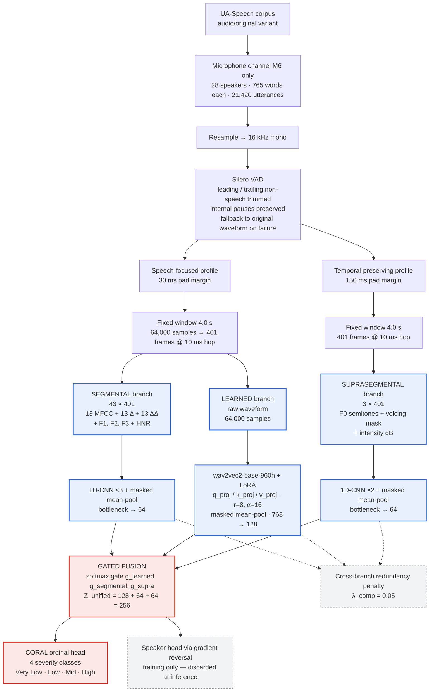

# Acoustic-Aware Fusion Architecture for Dysarthria Classification

> A three-branch neural architecture that fuses segmental, suprasegmental, and self-supervised speech representations to classify dysarthria severity from the UA-Speech corpus under speaker-disjoint evaluation.

[](https://www.python.org/)
[](https://pytorch.org/)
[](https://huggingface.co/docs/transformers)
[-0.19.1-6F42C1)](https://huggingface.co/docs/peft)
[](tests/)
[](#current-status)
[](LICENSE)

---

## Research overview

Dysarthria is a motor speech disorder whose acoustic signature spans several distinct levels of the speech signal at once: *articulatory precision* (consonant blurring, vowel-space centralization), *phonatory and prosodic control* (monopitch, reduced loudness variation, irregular voicing), and *higher-level contextual structure* that a purely handcrafted descriptor set does not capture.

This repository implements and evaluates a **three-branch gated-fusion architecture** built on the premise that these levels carry *complementary* information, and that a model given access to all three under an explicit anti-redundancy objective should be better grounded than one reasoning solely inside a learned latent space.

The scientific claim under test is deliberately narrow: **whether combining the three representations outperforms any subset of them.** That claim is not yet settled — see [Current status](#current-status).

## Key idea

A single self-supervised encoder (wav2vec 2.0) is a strong but opaque representation: it is not expressible in terms a speech pathologist uses by name, and it cannot be related back to a specific impairment. Conversely, classical acoustic descriptors (MFCC, formants, F0, intensity, HNR) are clinically interpretable but individually weaker.

Rather than choosing between them or concatenating them flatly, this architecture:

1. **Bottlenecks each branch before fusion**, forcing every branch to retain only decision-relevant information;
2. **Fuses with a learned softmax gate** whose weights are logged per batch, so branch reliance is *inspectable* rather than assumed;
3. **Penalizes cross-branch redundancy** with a Barlow-Twins-style cross-covariance term, discouraging the three branches from re-encoding the same signal;
4. **Suppresses speaker identity** in the fused representation via a gradient-reversal adversarial head — critical when the corpus has only 15 dysarthric speakers;
5. **Treats severity as ordinal**, not nominal, using a CORAL head, since Very Low < Low < Mid < High is a real ordering a softmax discards.

## Architecture



### Branch specification

All dimensions below are read from `src/config.py` and verified by `tests/test_gated_fusion_shapes.py`.

| Branch | Input | Preprocessing profile | Encoder | Output |
|---|---|---|---|---|
| **Segmental** | 43 ch × 401 frames — 13 MFCC + Δ + ΔΔ (39) plus framewise F1–F3 and HNR (4) | Speech-focused (30 ms) | 3-layer 1D-CNN, masked mean-pool, linear bottleneck | `Z_segmental` — **64** |
| **Suprasegmental** | 3 ch × 401 frames — F0 (semitones), binary voicing mask, intensity (dB) | Temporal-preserving (150 ms) | 2-layer 1D-CNN, masked mean-pool, linear bottleneck | `Z_supra` — **64** |
| **Learned** | Raw 16 kHz waveform, 64,000 samples | Speech-focused (30 ms) | `facebook/wav2vec2-base-960h` + LoRA, masked mean-pool, projection | `Z_learned` — **128** |
| **Fusion** | The three bottlenecked embeddings | — | Learned softmax gate, weighted concatenation | `Z_unified` — **256** |
| **Head** | `Z_unified` | — | CORAL ordinal (shared projection + K−1 thresholds) | **4** severity classes |

### Why three representations

Each branch is **designed to capture** a different level of the speech signal. These are architectural design rationales, not yet empirically validated contributions — the ablation that would establish independent contribution has not been run at full scale.

- **Segmental** — short-time spectral and articulatory behaviour. MFCCs describe the spectral envelope; framewise formants locate the vowel in the vowel space (F2/F1 compression is a well-documented correlate of articulatory undershoot); HNR indexes voice quality. This branch is intended to carry *how precisely the vocal tract reached its targets*.
- **Suprasegmental** — pitch, voicing, and loudness behaviour over time. Deliberately minimal (3 channels), because UA-Speech utterances are isolated single words and cannot support phrase-level intonation or multi-word rhythm modelling. This branch is intended to carry *phonatory stability and prosodic control*.
- **Learned** — contextual structure from self-supervised pretraining on 960 h of read English. This branch is intended to carry *what the handcrafted descriptors do not represent*.

The redundancy penalty exists precisely because these roles could otherwise collapse into one another; the gate exists so that any such collapse is measurable rather than hidden.

## Dataset

**UA-Speech** — dysarthric and control speech, 765 isolated words per speaker across three blocks (B1–B3), recorded at 16 kHz through a multi-channel microphone array.

The corpus is **not redistributed here.** Obtain it from the dataset authors and place the archives in `data/raw/`:

```text
data/raw/UASpeech_original_C.tgz     # healthy controls
data/raw/UASpeech_original_FM.tgz    # dysarthric speakers
```

> [!IMPORTANT]
> **Audio variant.** UA-Speech ships three audio releases — `original`, `normalized`, and `noisereduce`. The archives used by this project contain **only `audio/original`**, and the pipeline extracts from that variant exclusively. No corpus-level loudness normalization is applied, and none is performed by this pipeline. Absolute recording level is therefore preserved in the signal — a deliberate choice, with a known open question attached (see [Limitations](#limitations-and-planned-validation)).

**Protocol:** microphone channel **M6 only**, all blocks, all word categories, no word-type filtering.

**Verified composition** — 28 speakers, 21,420 M6 utterances (11,475 dysarthric, 9,945 control), 765 words per speaker with no incomplete speakers.

| Group | n | Speakers |
|---|---|---|
| Healthy control | 13 | CF02–CF05, CM01, CM04–CM06, CM08–CM10, CM12, CM13 |
| Dysarthric | 15 | F02–F05, M01, M04, M05, M07–M12, M14, M16 |

| Severity | n | Speakers |
|---|---|---|
| Very Low | 4 | M01, M04, F03, M12 |
| Low | 3 | M07, F02, M16 |
| Mid | 3 | M05, M11, F04 |
| High | 5 | M09, M14, M10, M08, F05 |

Corpus reference material (word-level MLF alignments, lexicon, license, readme) is kept in `data/uaspeech_corpus_docs/`, separate from the audio the pipeline scans.

<details>
<summary><b>Data verification note</b> — filename parsing and duplicate handling</summary>

An earlier exploratory scan reported inconsistent speaker and microphone counts due to a filename-parsing defect: it extracted the microphone channel by searching for the first underscore-separated token beginning with `M`, which matched male dysarthric speaker IDs such as `M01` before reaching the trailing mic token. The scan now takes the channel **positionally** from the final token.

The corrected scan also skips macOS resource-fork duplicates (`._` prefix), which the archives contain alongside the real `.wav` files and which would otherwise double the apparent file count.
</details>

## Preprocessing

Every utterance passes through one deterministic chain (`src/preprocessing.py`, `src/vad.py`):

1. Load, mix to mono, resample to **16 kHz**
2. **Silero VAD** — trim leading and trailing non-speech; the kept region is a *contiguous span* from first to last speech segment, so **internal pauses are preserved by construction**. Any failure (no speech detected, span too short, model error) falls back to the original waveform, recorded as `fallback_used`
3. Pad or truncate to a fixed **4.0 s / 64,000-sample** window, returning a `valid_length` so padding is *masked*, never treated as silence

| Parameter | Value | Source |
|---|---|---|
| Sample rate | 16 kHz | `config.TARGET_SR` |
| Fixed window | 4.0 s = 64,000 samples = 401 frames | `config.CLIP_SECONDS`, `config.MAX_SAMPLES` |
| MFCC | 13 coefficients, `n_fft=400` (25 ms), `hop_length=160` (10 ms), `n_mels=40` | `config.N_MFCC`, `config.MEL_KWARGS` |
| VAD threshold | 0.5 | `config.VAD_THRESHOLD` |
| Min speech / silence | 100 ms / 100 ms | `config.VAD_MIN_SPEECH_MS`, `config.VAD_MIN_SILENCE_MS` |
| Speech-focused pad margin | 30 ms | `config.VAD_SPEECH_PAD_MS` |
| Temporal-preserving pad margin | 150 ms | `config.SUPRA_VAD_SPEECH_PAD_MS` |

**Two VAD profiles.** The Learned and Segmental branches consume the *speech-focused* profile (30 ms margin). The Suprasegmental branch consumes a *temporal-preserving* profile (150 ms margin), which protects the onset/offset dynamics — breathiness ramp-in, voicing decay — that a prosodic encoder needs and a tight margin can clip. The two profiles carry independent valid-length values (`attention_mask` and `supra_valid_frames` respectively), and both are propagated into masked pooling.

> [!NOTE]
> **F0 representation contract.** Voiced frames carry a real F0 estimate in semitones; unvoiced frames are exactly **0**, disambiguated by an explicit binary voicing channel. No contour is interpolated or fabricated through unvoiced regions — the model is shown where pitch genuinely was not measurable. Enforced by `tests/test_supra_sequence_masking.py`.

## Training strategy

| Aspect | Setting | Source |
|---|---|---|
| Backbone | `facebook/wav2vec2-base-960h`, frozen | `config.WAV2VEC_MODEL_NAME` |
| Adaptation | LoRA — `q_proj`, `k_proj`, `v_proj` across all 12 encoder layers | `config.LORA_TARGET_MODULES` |
| LoRA hyperparameters | r = 8, α = 16, dropout = 0.1, bias = none | `config.LORA_RANK`, `LORA_ALPHA`, `LORA_DROPOUT` |
| Severity loss | Class-weighted CORAL ordinal loss | `src/losses.py` |
| Redundancy penalty | λ_comp = 0.05 | `config.LAMBDA_COMP` |
| Speaker adversarial | λ_speaker = 0.1, GRL strength 1.0 | `config.LAMBDA_SPEAKER`, `config.GRL_LAMBDA` |
| Optimizer | AdamW — lr 1e-3 (head/branches/LoRA), 1e-4 (backbone), weight decay 1e-2 | `config.DEFAULT_LR_HEAD`, `DEFAULT_LR_BACKBONE` |
| Schedule | `ReduceLROnPlateau`, early stopping patience 3 on val loss | `config.DEFAULT_PATIENCE` |
| Batch / epochs | 32 / 15 max, gradient clipping 1.0, AMP on CUDA | `config.DEFAULT_BATCH_SIZE`, `DEFAULT_EPOCHS` |
| Validation | 10% stratified, carved from each fold's train split | `config.DEFAULT_VAL_FRACTION` |
| Seed | 42 | `config.DEFAULT_SEED` |
| Compute budget | Hard 10h wall-clock cap for the 15-fold primary run (RTX 4060 laptop, 8GB) — enforced via a measured, not guessed, per-fold-epoch deadline | `config.PRIMARY_SEVERITY_BUDGET_HOURS`, `src.training.budget.ExperimentBudgetManager` |

> [!NOTE]
> **Patience 3 / epoch ceiling 15 is a compute-budget-driven tightening, not an
> accuracy tweak.** Early stopping on validation loss is this architecture's
> primary anti-overfitting mechanism; a tighter patience stops training past
> convergence on a 14-speaker-per-fold training set rather than let it run
> longer than the point it's actually still learning something general. The
> epoch ceiling is a ceiling early stopping is expected to trigger well
> before, not a target. `notebooks/03_training.ipynb`'s COMPUTE BUDGET stage
> measures real per-fold-epoch cost on the actual training machine
> (`ExperimentBudgetManager.benchmark`) and projects it against the 10h cap
> (`.preflight()`) before the one-shot run is ever started; the `MODE=
> "FINAL"` cell threads the resulting deadline into `run_training(...,
> deadline=...)`, so the cap is enforced by measured wall-clock time, not
> merely assumed to fit.

> [!WARNING]
> **SpecAugment is deliberately disabled.** `facebook/wav2vec2-base-960h` is a CTC checkpoint whose weights omit `masked_spec_embed`. Under Transformers 5.5.4, a positive masking probability would instantiate that parameter **randomly** and use it during training, injecting an unpretrained component into the learned branch. The pipeline therefore sets `apply_spec_augment=False`, `mask_time_prob=0.0`, and `mask_feature_prob=0.0` **before** model construction (`src/models/deep_pathway.py`), so the parameter is never created. The `lm_head` keys reported as unexpected at load time are the checkpoint's discarded CTC head and are expected. Regularization remains substantial without it: LayerDrop and five backbone dropouts at 0.1 (checkpoint defaults, untouched), LoRA dropout 0.1, weight decay, gradient clipping, early stopping, plus the redundancy and adversarial terms.

Hyperparameters introduced by this architecture are fixed in `src/config.py` **before** the run and are never tuned against its results. `src.training.reporting.write_frozen_config` records the git commit, software versions, architecture, and hyperparameters; `check_frozen_config_guard` raises if a run with the same name is later attempted under a different configuration.

## Evaluation protocol

All protocols are **speaker-disjoint**: no speaker ever appears in both the training and test side of a fold. Because UA-Speech labels are assigned at the speaker level, the effective sample size for generalization is the *speaker count*, not the utterance count — 15 for severity, not 11,475.

| Protocol | Folds | Held out | Status | Implementation |
|---|---|---|---|---|
| **Detection** | 28 | One speaker (any group) | Supported | `splits.iter_loso_folds` |
| **Severity — PRIMARY** | 15 | One dysarthric speaker | **Reported result** | `splits.iter_severity_loso_folds` |
| **Severity — secondary** | 81 | One speaker per class | Sanity check only | `splits.build_severity_folds` |

**Primary severity — full-population LOSO.** All 15 dysarthric speakers, no speaker dropped. The 4/3/3/5 class imbalance is handled at the loss and metric level (class-weighted CORAL, macro-F1, balanced accuracy, per-class recall, ordinal MAE) rather than by discarding speakers.

**Secondary severity — legacy balanced protocol.** `config.DROPPED_FOR_BALANCE` excludes M12, M08, and M09 to reach three speakers per class, giving 3⁴ = 81 leave-one-per-class-out iterations. The reference work gives no explicit exclusion list, so this particular set of three speakers is **an assumption of this implementation**, not a reproduction. It is retained only as an explicitly labelled secondary check and is **not** the reported number.

> [!NOTE]
> The 10% validation split is carved from each fold's *training* portion at the utterance level, so validation speakers are a subset of training speakers. This is sound for model selection and early stopping, but validation metrics are optimistically biased and must never be reported as generalization performance.

## Research context

This project builds on, but does not reproduce, the following work:

> Javanmardi, F., Tirronen, S., Kodali, M., Kadiri, S. R., and Alku, P.
> *Wav2vec-based Detection and Severity Level Classification of Dysarthria from Speech.* ICASSP 2023. [arXiv:2309.14107](https://arxiv.org/abs/2309.14107)

**What the reference work does.** A **frozen** wav2vec 2.0 is used as a fixed feature extractor feeding an SVM classifier; a per-layer sweep finds that early-layer embeddings favour detection while final-layer embeddings favour severity.

**How this implementation differs.** These are architectural and methodological differences, stated as design decisions — not as demonstrated improvements, since the comparative experiment has not been run.

| Dimension | Reference work | This implementation |
|---|---|---|
| Backbone use | Frozen feature extractor | LoRA-adapted (q/k/v, 12 layers) |
| Classifier | SVM on pooled embeddings | End-to-end three-branch network |
| Representations | wav2vec 2.0 only | Segmental + suprasegmental + learned |
| Fusion | None (single representation) | Learned gate + redundancy penalty |
| Severity head | Nominal classification | CORAL ordinal |
| Speaker confounds | Not explicitly addressed | Gradient-reversal adversarial head |
| Severity protocol | Balanced, speakers dropped | Full-population 15-fold LOSO (primary) |

**Shared with the reference work:** the UA-Speech corpus, the M6-only microphone protocol, the four-level severity taxonomy, and the 39-dimensional MFCC baseline feature definition.

Additional methods used:

> Cao, W., Mirjalili, V., and Raschka, S. *Rank consistent ordinal regression for neural networks with application to age estimation.* Pattern Recognition Letters, 2020. (CORAL head)
>
> Ganin, Y. and Lempitsky, V. *Unsupervised domain adaptation by backpropagation.* ICML 2015. (Gradient reversal)
>
> Hu, E. J. et al. *LoRA: Low-Rank Adaptation of Large Language Models.* ICLR 2022.

## Repository structure

All logic lives in `src/`. Notebooks are the sole front end — they call `src/`, run training, and store artifacts, so behaviour never drifts between script and notebook. **To change behaviour, edit the module, not a notebook.**

```text
notebooks/
  01_data_pipeline.ipynb     Manifest build (scan → verify → M6 filter → label → split → dataset),
                              VAD/padding diagnostics, three-branch data-pipeline audit
  02_feature_analysis.ipynb  Praat statistical EDA (MFCC + VAD validation, feature extraction,
                              severity-group significance testing); speech-processing EDA
                              (VAD+GAD voiced/unvoiced/silence segmentation, formant tracks,
                              short-time time/frequency-domain parameters, wideband/narrowband
                              spectrograms, cepstral analysis, MFCC, Linear Prediction analysis);
                              feature-extraction summary (per-branch inventory table, trainable-
                              parameter counts, Z_unified composition, channel breakdown)
  03_training.ipynb          One-shot training interface: frozen config, fold summary, model
                              audit, dummy forward pass, measured compute-budget stage
                              (batch-size benchmark, per-fold-epoch benchmark, wall-clock
                              deadline wired into the real run), smoke test, MODE-gated real run
  04_model_analysis.ipynb    Branch embeddings, inference-time branch ablation, gate analysis,
                              PCA/UMAP, complementarity heatmap, SHAP, permutation importance
  05_error_analysis.ipynb    Confusion matrix, per-class and ordinal-error breakdown,
                              representative-utterance signal panels
  06_results.ipynb           Paper-ready tables and figures, limitations table, CSV export
src/
  config.py                  Paths, speaker ground truth, label maps, all hyperparameters
  extraction.py              Archive extraction (audio/original)
  scanning.py                Filename parsing, verification, mic filter, severity labels
  preprocessing.py           Resampling, VAD trimming, padding, MFCC, the two VAD profiles,
                              framewise segmental/suprasegmental extraction
  vad.py                     Silero VAD wrapper (trim, fallback, per-utterance stats)
  praat.py                   Utterance-level Praat features + framewise F0/voicing/intensity
                              and formant/HNR extraction + severity-group significance
  losses.py                  CORAL ordinal loss, cross-branch redundancy penalty, GRL
  splits.py                  Detection LOSO, primary severity LOSO, legacy balanced 81-fold
  dataset.py                 UASpeechDataset
  model_analysis.py          Branch ablation, embedding projections, gate analysis, SHAP
  error_analysis.py          Per-error diagnostics, signal panels
  results.py                 Cross-experiment aggregation, eligibility gate, paper tables
  visualization.py           Praat statistical EDA figures, VAD-validation panel
  eda.py                     Speech-processing EDA: short-time time/frequency-domain
                              parameters, wideband/narrowband spectrograms, cepstral analysis,
                              Linear Prediction analysis, VAD+GAD three-way segmentation
  console.py  style.py       Console formatting and the shared plot color system (per-branch,
                              per-formant, voicing-region, and severity-sequential palettes)
  models/
    gated_fusion.py          GatedFusionModel — gate, CORAL head, GRL head, branch ablation
    segmental_pathway.py     Segmental branch: 43 ch → 64
    suprasegmental_pathway.py Suprasegmental branch: 3 ch → 64
    deep_pathway.py          wav2vec 2.0 (+ LoRA) → 768
    acoustic_pathway.py      1D-CNN over MFCC → 128          (earlier variant family)
    concat_fusion.py         Concatenation fusion             (earlier variant family)
    attention_fusion.py      Cross-attention fusion           (earlier variant family)
  training/
    models.py                Model factory + variant registry
    data.py                  Manifest loading, train/val split, DataLoaders, speaker map
    runner.py                TrainingConfig + run_training(): the fold loop
    engine.py                Train/eval epoch loop, AMP, training_step hook, gate collection
    metrics.py               Classification metrics + ordinal MAE, NaN-safe
    reporting.py             Artifact I/O, feature audit, frozen-config write/guard
    baseline.py              Frozen wav2vec + linear SVM per fold
    budget.py                ExperimentBudgetManager: wall-clock budget allocation
    checkpoint.py  early_stopping.py  utils.py
tests/                       10 modules, 86 tests — architecture shapes, CORAL/redundancy/GRL
                              numerics, LOSO fold construction, masking, frame alignment,
                              frozen-config round-trip, experiment-validity guards
data/
  raw/                       Place the UA-Speech .tgz archives here
  extracted/                 Extracted .wav files (gitignored)
  uaspeech_corpus_docs/      Corpus reference material
outputs/                     All generated artifacts (gitignored) — checkpoints, logs,
                              predictions, metrics, figures, embeddings, tables, results
```

An earlier seven-variant detection/severity ablation ladder (`acoustic`, `deep_frozen`, `deep_lora`, `fusion_frozen`, `fusion`, `attention_fusion`, `attention_fusion_praat`) remains available through `src/training/models.py` and is still runnable via `run_training`, but its dedicated notebooks have been removed and it is **not** part of the primary severity experiment.

## Reproducibility and environment

**Verified environment:** Python **3.10.20**, CUDA-enabled PyTorch. The repository declares no `python_requires`; the pinned dependency set is in `requirements.txt`.

```bash
# GPU wheels first (plain PyPI serves CPU-only builds under these version numbers)
pip install torch==2.5.1 torchaudio==2.5.1 --index-url https://download.pytorch.org/whl/cu121
pip install -r requirements.txt
```

| Package | Version |
|---|---|
| torch / torchaudio | 2.5.1 |
| transformers | 5.5.4 |
| peft | 0.19.1 |
| numpy / pandas / scipy | 2.2.6 / 2.3.3 / 1.15.3 |
| scikit-learn | 1.7.2 |
| praat-parselmouth | 0.4.7 |
| shap / umap-learn | 0.48.0 / 0.5.7 |
| pytest | 9.1.1 |

Silero VAD loads via `torch.hub` and needs internet access on first run only (~2 MB, cached thereafter). An optional `HF_TOKEN` environment variable (see `.env.example`) lifts the unauthenticated Hugging Face rate limit; the checkpoint used here is public and loads without it.

```bash
pytest                        # full suite — 86 tests
jupyter notebook notebooks/01_data_pipeline.ipynb
```

Run the notebooks in numerical order. Notebook 03 is gated:

```python
MODE = "SMOKE"     # default — the real 15-fold run does NOT execute
# MODE = "FINAL"   # deliberate human action only — the one-shot experiment
```

Training can also be driven directly:

```python
from src.training.runner import TrainingConfig, run_training

cfg = TrainingConfig(task="severity", model="gated_fusion_three_branch")   # 15-fold LOSO
summary, pooled = run_training(df_m6, cfg)
```

Every fold writes a checkpoint, TensorBoard log (`tensorboard --logdir outputs/logs`), predictions CSV, metrics JSON, confusion matrix, ROC curve, and embeddings (fused, per-branch, plus gate weights) under `outputs/`. `TrainingConfig(..., max_folds=1, epochs=1, limit_samples=24)` gives a fast pipeline check.

## Current status

**The architecture and training protocol are frozen.** The table below distinguishes what is implemented and verified from what has actually been run.

| Component | Status |
|---|---|
| Three branches, bottlenecks, gated fusion | Implemented, unit-tested |
| CORAL head, redundancy penalty, speaker-adversarial GRL | Implemented, unit-tested |
| Data pipeline, two VAD profiles, framewise extraction | Implemented; executed against the real corpus in Notebook 01 |
| Speech-processing EDA, feature-extraction summary (Notebook 02) | Implemented; executed against the real corpus |
| Compute-budget stage (Notebook 03) — measured batch size, per-fold-epoch benchmark, wall-clock deadline | Implemented; **not yet measured against real hardware** — the benchmark has not been run to completion in this checkout, so the 10h cap has not been confirmed sufficient for all 15 folds |
| Training / analysis / results notebooks | Built, import- and shape-validated |
| Test suite | **86 passing**, 0 failed, 0 skipped |
| **The one-shot 15-fold severity run** | **Not executed** — Notebook 03 defaults to `MODE = "SMOKE"` |
| Full 15-fold branch ablation | Not executed (see below) |

### Diagnostic findings — Notebook 01

Notebook 01 is a **data-pipeline and representation diagnostic**, not a source of scientific conclusions. Its observations to date, stated as diagnostics:

- **The 401-frame window is unchanged and remains the frozen configuration.** Earlier padding and truncation headline figures were computed from `speech_duration_s`, which is *not* the model's `valid_length`: it excludes internal pauses on VAD successes and equals full file duration on VAD fallbacks. Those figures are therefore **not** a valid basis for resizing the window, and no resize is proposed.
- **F0 handling was corrected** to preserve unvoiced frames as zero with an explicit voicing mask, with no fabricated contour. Verified against real audio.
- **SpecAugment was deliberately disabled** for checkpoint compatibility, as documented above.
- **LoRA remains the adaptation mechanism**, unchanged at q/k/v across 12 encoder layers.
- **Further evidence is required before any architectural change.** No diagnostic to date establishes a defect in the architecture.

## Limitations and planned validation

Open questions, framed as validation experiments rather than known failures. None currently justifies an architectural change.

| # | Question | Why it matters | Planned experiment |
|---|---|---|---|
| 1 | **True valid-length distribution** | The window's justification currently rests on a proxy quantity, not on `valid_length` semantics | Re-derive the retained-span distribution from cached VAD statistics; report median/p75/p90/p95/p99/max, padding and truncation fractions |
| 2 | **Duration ↔ severity relationship** | Determines whether any length-dependent effect is a confound or genuine signal | Stratify the valid-length distribution by severity class |
| 3 | **Padding and boundary effects** | Masked pooling excludes padded frames, but convolution and pooling operate before it, so boundary behaviour is worth quantifying | Measure branch-embedding sensitivity to padding at fixed speech content |
| 4 | **Intensity normalization sensitivity** | `audio/original` preserves absolute recording level, which is partly a device and session property | Decompose intensity variance into speaker vs severity components before deciding whether normalization is warranted |
| 5 | **Full 15-fold branch ablation** | Branch contribution is currently evaluated on a single fold, which cannot support a claim at n = 15 speakers | Extend `evaluate_branch_ablation` across all 15 folds under the primary protocol |
| 6 | **Checkpoint-to-speaker matching robustness** | Analysis notebooks pair the alphabetically-first checkpoint with the first fold; these agree today only because the speaker list happens to be lexicographically ordered | Bind checkpoint to fold explicitly rather than by ordering coincidence |

Structural limitations that no experiment removes: **15 dysarthric speakers** is a small population for a 4-class severity task (3 speakers in the smallest classes), UA-Speech contains **isolated single words** only — so phrase-level prosody and connected-speech timing cannot be modelled — and all findings are corpus-specific until validated on an independent dysarthric corpus.

## License

MIT — see [LICENSE](LICENSE). The licence covers this source code only. **The UA-Speech database carries its own separate licence and data use agreement** (academic/government research use only, no redistribution) — see `data/uaspeech_corpus_docs/UASPEECH_LICENSE.txt` once the corpus is obtained.

## Acknowledgments

With thanks to the creators and maintainers of the UA-Speech corpus at the University of Illinois at Urbana-Champaign, and to the participants who contributed their speech recordings to advance assistive-technology research:

> H. Kim, M. Hasegawa-Johnson, A. Perlman, J. Gunderson, T. Huang, K. Watkin, and S. Frame,
> *Dysarthric Speech Database for Universal Access Research,* Interspeech, 2008.
