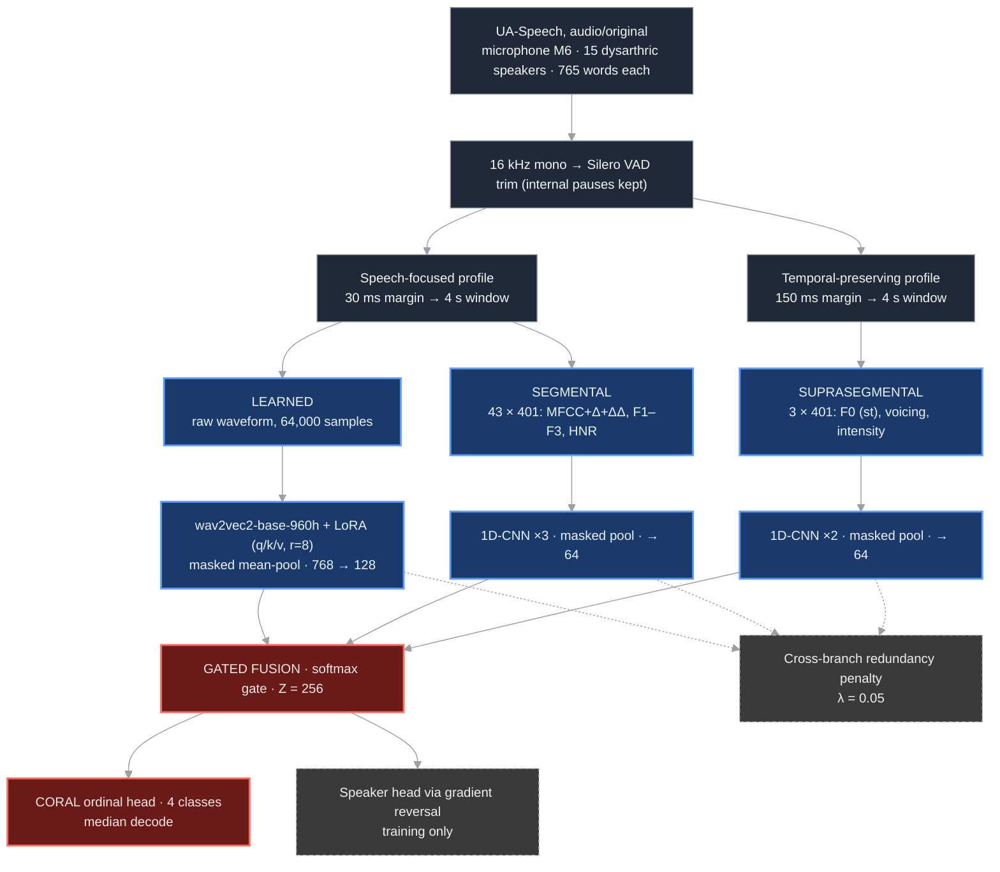

# Acoustic-Aware Fusion Architecture for Dysarthria Classification

> A three-branch neural architecture that fuses segmental, suprasegmental, and self-supervised speech representations to classify dysarthria severity from the UA-Speech corpus under speaker-disjoint evaluation.

[](https://www.python.org/)
[](https://pytorch.org/)
[](https://huggingface.co/docs/transformers)
[-0.19.1-6F42C1)](https://huggingface.co/docs/peft)
[](LICENSE)

---

## Research overview

Dysarthria is a motor speech disorder whose acoustic signature spans several levels of the speech signal at once: *articulatory precision* (consonant blurring, vowel-space centralization), *phonatory and prosodic control* (monopitch, reduced loudness variation, irregular voicing), and *higher-level contextual structure* that a handcrafted descriptor set does not capture.

This repository implements and evaluates a **three-branch gated-fusion architecture** built on the premise that these levels carry *complementary* information. The claim under test is deliberately narrow: **whether combining the three representations outperforms any subset of them.** It is not yet settled — see [Current status](#current-status).

## Key idea

A self-supervised encoder (wav2vec 2.0) is strong but opaque; classical descriptors (MFCC, formants, F0, intensity, HNR) are clinically interpretable but individually weaker. Rather than choosing between them or concatenating them flatly, this architecture:

1. **Bottlenecks each branch before fusion**, so every branch keeps only decision-relevant information;
2. **Fuses with a learned softmax gate** whose weights are saved per utterance, so branch reliance is *inspectable* rather than assumed;
3. **Penalizes cross-branch redundancy** with a Barlow-Twins-style cross-correlation term;
4. **Suppresses speaker identity** in the fused representation with a gradient-reversal adversarial head;
5. **Treats severity as ordinal** with a CORAL head, since Very Low < Low < Mid < High is a real ordering.

## Architecture


```mermaid
%%{init: {"theme": "base", "themeVariables": {"primaryColor": "#1f2937", "primaryTextColor": "#f5f5f5", "primaryBorderColor": "#9aa0a6", "lineColor": "#9aa0a6", "fontSize": "14px"}}}%%
flowchart TD
    UA["UA-Speech, audio/original<br/>microphone M6 · 15 dysarthric speakers · 765 words each"]
    VAD["16 kHz mono → Silero VAD trim (internal pauses kept)"]
    UA --> VAD
    P1["Speech-focused profile<br/>30 ms margin → 4 s window"]
    P2["Temporal-preserving profile<br/>150 ms margin → 4 s window"]
    VAD --> P1
    VAD --> P2

    LRN["LEARNED<br/>raw waveform, 64,000 samples"]
    SEG["SEGMENTAL<br/>43 × 401: MFCC+Δ+ΔΔ, F1–F3, HNR"]
    SUP["SUPRASEGMENTAL<br/>3 × 401: F0 (st), voicing, intensity"]
    P1 --> LRN
    P1 --> SEG
    P2 --> SUP

    ELRN["wav2vec2-base-960h + LoRA (q/k/v, r=8)<br/>masked mean-pool · 768 → 128"]
    ESEG["1D-CNN ×3 · masked pool · → 64"]
    ESUP["1D-CNN ×2 · masked pool · → 64"]
    LRN --> ELRN
    SEG --> ESEG
    SUP --> ESUP

    GATE["GATED FUSION · softmax gate · Z = 256"]
    ELRN --> GATE
    ESEG --> GATE
    ESUP --> GATE
    HEAD["CORAL ordinal head · 4 classes<br/>median decode"]
    SPK["Speaker head via gradient reversal<br/>training only"]
    RED["Cross-branch redundancy penalty<br/>λ = 0.05"]
    GATE --> HEAD
    GATE --> SPK
    ELRN -.-> RED
    ESEG -.-> RED
    ESUP -.-> RED

    classDef branch fill:#1a3a6b,stroke:#5b9bff,stroke-width:2px,color:#eaf1ff
    classDef fusion fill:#6b1a1a,stroke:#ff6b5b,stroke-width:2px,color:#ffe8e5
    classDef aux fill:#3a3a3a,stroke:#b0b6bb,stroke-dasharray:4 3,color:#f0f0f0
    class SEG,LRN,SUP,ESEG,ELRN,ESUP branch
    class GATE,HEAD fusion
    class SPK,RED aux
```

| Branch | Input | Profile | Encoder | Output |
|---|---|---|---|---|
| **Learned** | Raw 16 kHz waveform, 64,000 samples, per-utterance normalized | Speech-focused (30 ms) | `facebook/wav2vec2-base-960h` + LoRA, masked mean-pool, projection | **128** |
| **Segmental** | 43 × 401: 13 MFCC + Δ + ΔΔ, framewise F1–F3, HNR | Speech-focused (30 ms) | 3-layer 1D-CNN, masked mean-pool, bottleneck | **64** |
| **Suprasegmental** | 3 × 401: F0 (semitones, 0 when unvoiced), voicing mask, intensity (dB) | Temporal-preserving (150 ms) | 2-layer 1D-CNN, masked mean-pool, bottleneck | **64** |
| **Fusion → head** | The three embeddings | — | Softmax gate, weighted concatenation, CORAL | **256 → 4 classes** |

Dimensions are read from `src/config.py` and pinned by `tests/test_gated_fusion_shapes.py`.

## Dataset

**UA-Speech** — dysarthric and control speech, 765 isolated words per speaker in three blocks (B1–B3). The corpus is **not redistributed here**; obtain it from its authors and place the archives in `data/raw/`:

```text
data/raw/UASpeech_original_C.tgz     # healthy controls
data/raw/UASpeech_original_FM.tgz    # dysarthric speakers
```

Only the `audio/original` release is used (no loudness normalization). Microphone channel **M6**, all blocks, all word categories. The severity task uses the 15 dysarthric speakers (11,475 utterances):

| Severity | n | Speakers |
|---|---|---|
| Very Low | 4 | M01, M04, F03, M12 |
| Low | 3 | M07, F02, M16 |
| Mid | 3 | M05, M11, F04 |
| High | 5 | M09, M14, M10, M08, F05 |

Filename parsing takes the microphone channel positionally from the final token (searching for a token starting with `M` would match speaker IDs like `M01`), skips macOS `._` resource forks, and drops the corpus's zero-filled files by checking their RIFF/WAVE header.

## Preprocessing

1. Load, mix to mono, resample to **16 kHz**.
2. **Silero VAD** trims leading and trailing non-speech; the kept region is the contiguous span from the first to the last speech segment, so **internal pauses are preserved**. Any failure falls back to the untrimmed waveform.
3. Pad or truncate to a fixed **4.0 s / 64,000-sample** window (401 frames at a 10 ms hop), returning `valid_length` so padding is **masked** in every pooling step, never treated as silence.

Two VAD profiles differ only in the margin kept around speech: 30 ms for the learned and segmental branches, 150 ms for the suprasegmental branch, which needs onset/offset dynamics. **F0 contract:** voiced frames carry a semitone value; unvoiced frames are exactly 0 and flagged by the voicing channel — no contour is interpolated through them, and normalization keeps them at 0.

**Fold-scoped standardization.** Segmental and suprasegmental channels are z-scored with statistics computed from each fold's *training* speakers only (over valid frames; F0 over voiced frames), so the held-out speaker never influences its own normalization.

**Feature store.** Silero and ~2,000 Praat calls per utterance are far too slow to run per epoch. `src/feature_store.py` computes each utterance's VAD spans and both feature tensors once, in parallel, into one compressed chunk per (speaker, block) under `outputs/feature_cache/store/`. Chunks are written atomically (an interrupted build keeps every finished chunk), memory-mapped at read time (one copy shared by all DataLoader workers), and keyed by a configuration signature (a chunk built under different settings is ignored). The notebook re-runs live Silero on 300 utterances and recomputes 24 feature tensors through the original live path, requiring **bit-exact** equality.

## Training

| Aspect | Setting | Source |
|---|---|---|
| Backbone | `facebook/wav2vec2-base-960h`, frozen; SpecAugment off (the CTC checkpoint has no pretrained `masked_spec_embed`) | `config.WAV2VEC_*` |
| Adaptation | LoRA on `q_proj`, `k_proj`, `v_proj` of all 12 layers — r = 8, α = 16, dropout 0.1 | `config.LORA_*` |
| Loss | Class-weighted CORAL + 0.05 × redundancy + 0.1 × adversarial speaker CE (GRL strength 1.0) | `config.LAMBDA_*` |
| Decoding | Median of the CORAL distribution — argmax starves Low/Mid when thresholds are close | `losses.coral_rank_from_class_probs` |
| Optimizer | AdamW, weight decay 1e-2 — **LoRA adapters 1e-4**, branches / projections / gate / heads 1e-3 | `config.DEFAULT_LR_*`, `engine.build_optimizer` |
| Schedule | ReduceLROnPlateau (×0.5); early stopping, patience 3, on the validation ordinal loss | `config.DEFAULT_PATIENCE` |
| Batch / epochs | 32, fp16 AMP, gradient clipping 1.0 / at most 12 | `config.DEFAULT_*` |
| Validation | Speaker-disjoint: one speaker per class that keeps ≥ 2 training speakers (3–4 per fold), seeded per fold | `data.speaker_disjoint_train_val_split` |
| Seed | 42, re-seeded per fold so a fold's result does not depend on which folds ran before it | `runner.run_fold` |

Hyperparameters are fixed in `src/config.py` before the run. `write_frozen_config` records the configuration, git commit and software versions under `outputs/results/<run>/frozen_config.json`; `check_frozen_config_guard` refuses to re-run the same run name under a different configuration (resuming the same one is fine).

## Evaluation protocol

**Leave-one-speaker-out over all 15 dysarthric speakers** — no speaker is dropped to balance classes; the 4/3/3/5 imbalance is handled by the class-weighted loss and macro metrics. Severity labels are speaker-level, so the effective sample size for generalization is **15 speakers**, not 11,475 utterances.

A held-out speaker has a single true class, so per-fold macro-F1, balanced accuracy and AUROC are undefined (reported as N/A, never 0). The reported numbers are **pooled** over every held-out utterance: accuracy, macro-F1, balanced accuracy, ordinal MAE, macro AUROC, per-class precision/recall, the confusion matrix, and a **speaker-level** decision (median of each speaker's utterance predictions).

## Running it on a laptop

Everything runs from `notebooks/training.ipynb` (**Run All**), measured on an RTX 4060 Laptop (8 GB, 88 W) with 16 GB RAM under Windows 11.

- **Measured, not assumed.** Section 6 times real training steps on this machine (~1 min) and projects the run time before the run starts.
- **Thermal guard.** Between batches, training pauses when the GPU reaches **83 °C** and resumes at **72 °C**, and each fold starts cool (`config.GPU_TEMP_*`, `FOLD_COOLDOWN_S`). It reads the sensor through `nvidia-smi`; pauses change only *when* work happens, never *what* is computed.
- **Power and sleep.** Training waits for the charger if the laptop is on battery, and keeps Windows awake while it runs. Lid closing still follows its own Windows setting — keep the lid open or set *When I close the lid → Do nothing* while plugged in.
- **Memory.** On Windows every DataLoader worker is a spawned process costing ~2 GB of commit, so training uses one persistent worker and evaluates in-process; worker counts are re-sized to the memory free before every fold. PyTorch's VRAM share is capped at 90% so an overflow raises a clean OOM instead of silently spilling into system RAM (which slows training ~10×).
- **Self-healing.** A failing fold is retried with an adapted configuration: CUDA OOM → half batch × 2 accumulation (same effective batch); host memory → no workers; divergence → restart in float32.
- **Resumable.** Finished folds load from disk; an interrupted fold resumes from its `latest.pt` (saved every epoch, ~9 MB since only trainable weights are stored). Optional `SESSION_HOURS` stops cleanly before a time cap.

## Repository structure

```text
notebooks/training.ipynb   The experiment: environment, data, feature store, model audit,
                            throughput, frozen config, training, results
src/
  config.py                Paths, speakers, labels, hyperparameters, hardware profile
  extraction.py            Archive extraction (audio/original)
  scanning.py              Filename parsing, verification, M6 filter, severity labels
  vad.py                   Silero VAD (trim, fallback)
  vad_cache.py             VAD spans served from the feature store + live verification
  praat.py                 Framewise F1–F3/HNR and F0/voicing/intensity (parselmouth)
  preprocessing.py         Loading, trimming, padding, MFCC, fold-scoped standardization
  feature_store.py         Chunked, resumable, memory-mapped feature store + verification
  dataset.py               UASpeechDataset
  splits.py                Severity leave-one-speaker-out folds
  losses.py                CORAL, cross-branch redundancy, gradient reversal
  console.py               Console report formatting and progress bars
  models/
    gated_fusion.py        GatedFusionModel: gate, CORAL head, speaker head, ablation switches
    deep_pathway.py        wav2vec 2.0 + LoRA
    segmental_pathway.py   43 ch → 64
    suprasegmental_pathway.py  3 ch → 64
  training/
    runner.py              TrainingConfig, the fold loop, retries, laptop safeguards
    engine.py              One epoch: AMP, accumulation, clipping, metrics, embeddings
    data.py                Manifest, validation split, class weights, DataLoaders
    models.py              Model registry: the full model and eight ablations
    metrics.py             Severity metrics (undefined → NaN)
    reporting.py           Artifacts, results rebuilt from disk, frozen config + guard
    session.py             Throughput calibration and run-time projection
    checkpoint.py  early_stopping.py  utils.py
tests/                     Shapes, losses, masking, frame alignment, folds and validation
                           split, metrics, frozen-config guard, feature-store and VAD-span
                           equality gates, and a real-data end-to-end training step
```

Every fold writes, under `outputs/<kind>/<run_name>/`: a checkpoint, TensorBoard logs (`tensorboard --logdir outputs/logs`), a predictions CSV, a metrics JSON, a confusion matrix and an embeddings file (fused, per-branch and gate weights per utterance).

### Ablations

`MODEL` in the notebook selects the full model or one of eight controlled ablations (`src/training/models.py`). All share data, folds, validation and optimizer; each gets its own run name.

| Name | Branches | Fusion | Redundancy | Speaker GRL |
|---|---|---|---|---|
| `ab1_wav2vec2_only` | learned | — | — | — |
| `ab2_acoustic_only` | segmental + supra | gated | — | — |
| `ab3_wav2vec2_acoustic_concat` | all three | concat | — | — |
| `ab4_wav2vec2_segmental` | learned + segmental | gated | — | — |
| `ab5_wav2vec2_suprasegmental` | learned + supra | gated | — | — |
| `ab6_full_fusion` | all three | gated | — | — |
| `ab7_full_complementarity` | all three | gated | ✓ | — |
| `ab8_full_speaker_grl` | all three | gated | — | ✓ |
| `gated_fusion_three_branch` | all three | gated | ✓ | ✓ |

## Reproducibility

```bash
conda create -n torch-gpu python=3.10 && conda activate torch-gpu
pip install torch==2.5.1 torchaudio==2.5.1 --index-url https://download.pytorch.org/whl/cu121
pip install -r requirements.txt
python -m ipykernel install --user --name torch-gpu
pytest                       # the real-data tests skip when the corpus is absent
```

Then open `notebooks/training.ipynb` with the `torch-gpu` kernel and Run All. `AAFA_SMOKE=1` (or `SMOKE_TEST = True`) runs a 2-fold, 1-epoch, 64-utterance end-to-end check. An optional `HF_TOKEN` in `.env` lifts the Hugging Face rate limit; the checkpoint is public.

## Current status

| Component | Status |
|---|---|
| Architecture, losses, ablation switches | Implemented, unit-tested |
| Data pipeline, two VAD profiles, framewise features, feature store | Implemented; store built for all 15 dysarthric speakers and verified bit-exact against the live pipeline |
| End-to-end notebook | Smoke-tested on the target laptop (2 folds × 1 epoch) |
| **The 15-fold severity run** | **Not yet executed** |
| Ablations ab1–ab8 | Not yet executed |

## Limitations and open questions

| # | Question | Why it matters | Planned check |
|---|---|---|---|
| 1 | **Speaker adversary vs. speaker-level labels** | Every utterance of a speaker has the same severity, so severity is itself partly speaker information; an adversary that removes speaker identity can also remove severity cues | Compare `ab6_full_fusion` with `ab8_full_speaker_grl` before trusting the GRL |
| 2 | **Truncation at 4 s** | ~8% of utterances exceed the window and lose their tail; long utterances are more frequent at higher severity | Stratify truncation by severity; compare a longer window |
| 3 | **Padding and boundary effects** | Masked pooling excludes padding, but convolutions and BatchNorm see it first (on average 68% of the window is padding) | Measure embedding sensitivity to padding at fixed speech content |
| 4 | **Recording level** | `audio/original` keeps absolute level, partly a session property | Decompose intensity variance into speaker vs. severity components |
| 5 | **Branch contribution** | Branch value is a claim only after the ablations run across all 15 folds | Run ab1–ab8 under the same protocol |

Structural limits no experiment removes: **15 dysarthric speakers** (3 in the smallest classes) is a small population for a 4-class task; UA-Speech contains **isolated words** only, so connected-speech prosody cannot be modelled; and all findings are corpus-specific until validated on an independent dysarthric corpus.

## License

MIT — see [LICENSE](LICENSE). The licence covers this source code only. **The UA-Speech database carries its own licence and data use agreement** (academic/government research use only, no redistribution).

## Acknowledgments

With thanks to the creators and maintainers of the UA-Speech corpus at the University of Illinois at Urbana-Champaign, and to the participants who contributed their speech recordings:

> H. Kim, M. Hasegawa-Johnson, A. Perlman, J. Gunderson, T. Huang, K. Watkin, and S. Frame,
> *Dysarthric Speech Database for Universal Access Research,* Interspeech, 2008.
